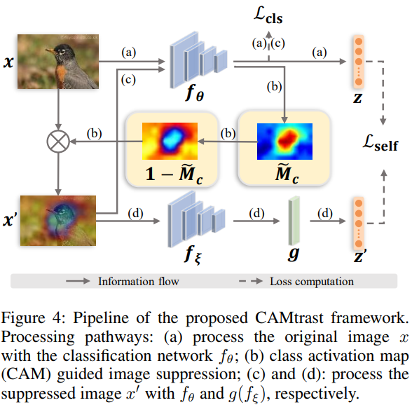

# Boost Supervised Pretraining for Visual Transfer Learning: Implications of Self-Supervised Contrastive Representation Learning
This repo contains the reference source code for the paper [**Boost Supervised Pretraining for Visual Transfer Learning: Implications of Self-Supervised Contrastive Representation Learning**] in AAAI2021. Our implementation is based on [Pytorch](https://pytorch.org/).
<div align="center">
	
</div>

This repository was built off of [Contrastive Multiview Coding](https://github.com/HobbitLong/CMC).

### Run the code
**Train**
```
python3.6 -u train.py --epochs 100 --batch_size 256 --num_workers 24 --nce_k 2048 --softmax --model resnet50st --aug cjv2 --model_name [model_name] --n_way 64 --epoch_t 30  
```
Path flags:
- `--model_name`: specify the name to save model.


**Test**
```
python3 test.py --resume [resume] [data_folder] --gpu 1 --arch resnet50st --n_way 5 --k_shot 5 --task_num 600 --moco-k 2048 -j 8 --train_way 64
```
Path flags:
- `--resume`: specify the path of pretrained model.
- `data_folder`: specify the data folder.


## Citation
Please cite our paper if the code is helpful to your research.
```
```

## Concact
If you have any question, please feel free to concat Jinghan Sun (Email: jhsun@stu.xmu.edu.cn)
