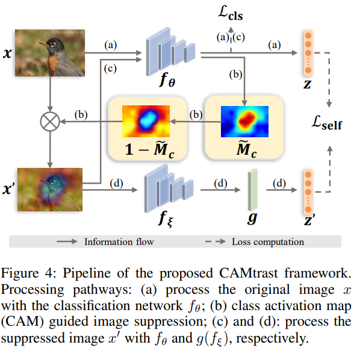

# Boost Supervised Pretraining for Visual Transfer Learning: Implications of Self-Supervised Contrastive Representation Learning
This repo contains the reference source code for the paper [**Boost Supervised Pretraining for Visual Transfer Learning: Implications of Self-Supervised Contrastive Representation Learning**] in AAAI2021. We also provided [supplementary materials](https://github.com/jinghanSunn/CAMtrast/blob/main/Supplementary.pdf).
Our implementation is based on [Pytorch](https://pytorch.org/).
<div align="center">
	
</div>

This repository was built off of [Contrastive Multiview Coding](https://github.com/HobbitLong/CMC).

### Run the code

#### Training
```bash
python3.6 -u train.py --epochs 100 --batch_size 256 --num_workers 24 --nce_k 2048 --softmax --model resnet50st --aug cjv2 --model_name [model_name] --n_way 64 --epoch_t 30
```

**Training Parameters:**

*Basic Training Settings:*
- `--epochs`: Number of training epochs (default: 240)
- `--batch_size`: Batch size for training (default: 64)
- `--num_workers`: Number of data loading workers (default: 18)
- `--print_freq`: Print frequency (default: 10)
- `--save_freq`: Model save frequency in epochs (default: 10)
- `--tb_freq`: TensorBoard logging frequency (default: 500)

*Optimization:*
- `--learning_rate`: Initial learning rate (default: 0.05)
- `--lr_decay_epochs`: Epochs to decay learning rate, e.g., '60,80' (default: '60,80')
- `--lr_decay_rate`: Learning rate decay rate (default: 0.1)
- `--momentum`: SGD momentum (default: 0.9)
- `--weight_decay`: Weight decay (default: 5e-4)
- `--warm`: Enable warm-up training
- `--amp`: Use mixed precision training
- `--opt_level`: Apex optimization level, choices: ['O1', 'O2'] (default: 'O2')

*Model Architecture:*
- `--model`: Model architecture, choices: ['resnet50', 'resnet50st', 'resnet50x2', 'resnet50x4'] (default: 'resnet50')
- `--model_name`: Name for saving the model (required)

*Dataset:*
- `--dataset`: Dataset name, choices: ['imagenet100', 'imagenet', 'tieredimage', 'cifar'] (default: 'imagenet100')
- `--data_folder`: Path to dataset folder (default: './mini_imagenet')
- `--n_way`: Number of classes for training (default: 64)
- `--image_num`: Number of images per class (default: 1300)

*Data Augmentation:*
- `--aug`: Augmentation strategy, choices: ['NULL', 'cjv2'] (default: 'CJ')
- `--crop`: Minimum crop ratio (default: 0.2)

*Contrastive Learning:*
- `--softmax`: Use softmax contrastive loss instead of NCE
- `--nce_k`: Number of negative samples for NCE (default: 16384)
- `--nce_t`: Temperature parameter for NCE (default: 0.07)
- `--nce_m`: Momentum for NCE (default: 0.5)
- `--moco`: Use MoCo instead of Instance Discrimination
- `--alpha`: Exponential moving average weight for MoCo (default: 0.999)

*CAM (Class Activation Map) Settings:*
- `--epoch_t`: Epoch threshold to start using CAM (default: 100)
- `--cam_mode`: Heatmap processing mode (default: 'reverse')
- `--cam_t`: Heatmap threshold for hard thresholding (default: 0.5)
- `--cam_momentum`: Use momentum update for heatmap
- `--cam_k`: Momentum ratio for heatmap update (default: 0.9)
- `--cam_aug`: Apply augmentation after CAM processing

*Additional Options:*
- `--resume`: Path to checkpoint for resuming training (default: '')
- `--gpu`: GPU id to use (default: None)
- `--unif`: Weight for uniform loss (default: 0)
- `--mixup`: Enable manifold mixup
- `--mix_alpha`: Mixup alpha parameter (default: 1.0)
- `--layer_mix`: Layer index for mixup (default: None)
- `--dim`: Feature dimension for SimSiam (default: 2048)
- `--pred-dim`: Predictor hidden dimension for SimSiam (default: 512)

---

#### Testing (Few-Shot Evaluation)
```bash
python3 test.py --resume [resume] [data_folder] --gpu 1 --arch resnet50st --n_way 5 --k_shot 5 --task_num 600 --moco-k 2048 -j 8 --train_way 64
```

**Testing Parameters:**

*Data:*
- `data`: Path to dataset (positional argument, required)
- `--dataset`: Dataset name, e.g., 'miniimage', 'tieredimage' (default: 'miniimage')
- `--data_folder`: Path to dataset folder (default: './mini_imagenet/')
- `--model_path`: Path to model directory (default: './model/')
- `--visual_dir`: Path to visualization directory (default: './log/visual/')

*Model:*
- `--arch` or `-a`: Model architecture (default: 'resnet50')
- `--resume`: Path to pretrained checkpoint (required)

*Few-Shot Settings:*
- `--n_way`: Number of classes per task (default: 5)
- `--train_way`: Number of classes used during training (default: 64)
- `--k_shot`: Number of support samples per class (default: 1)
- `--k_query`: Number of query samples per class (default: 15)
- `--task_num`: Number of testing tasks (default: 1000)
- `--select_cls`: Select specific classes for testing (default: None)

*Data Loading:*
- `--workers` or `-j`: Number of data loading workers (default: 0)
- `--batch-size` or `-b`: Mini-batch size (default: 256)

*Fine-tuning (if needed):*
- `--lr`: Initial learning rate for fine-tuning (default: 0.03)
- `--momentum`: SGD momentum (default: 0.9)
- `--weight_decay` or `--wd`: Weight decay (default: 1e-4)
- `--pe` or `--pretrain_epoch`: Epochs for pretraining on support set (default: 20)
- `--update_step`: Task-level inner update steps (default: 5)
- `--update_step_test`: Update steps for fine-tuning (default: 10)
- `--meta_lr`: Meta-level outer learning rate (default: 1e-3)
- `--update_lr`: Task-level inner learning rate (default: 0.4)

*MoCo Settings:*
- `--moco-dim`: Feature dimension (default: 128)
- `--moco-k`: Queue size / number of negative keys (default: 1280)
- `--moco-m`: MoCo momentum for updating key encoder (default: 0.999)
- `--moco-t`: Softmax temperature (default: 0.07)
- `--mlp`: Use MLP head
- `--aug-plus`: Use MoCo v2 data augmentation
- `--cos`: Use cosine learning rate schedule

*System:*
- `--gpu`: GPU id to use (default: None)
- `--seed`: Random seed for reproducibility (default: 111)


## Citation
Please cite our paper if the code is helpful to your research.
```
```

## Contact
If you have any questions, please feel free to contact Jinghan Sun (Email: jhsun@stu.xmu.edu.cn)
